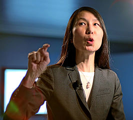
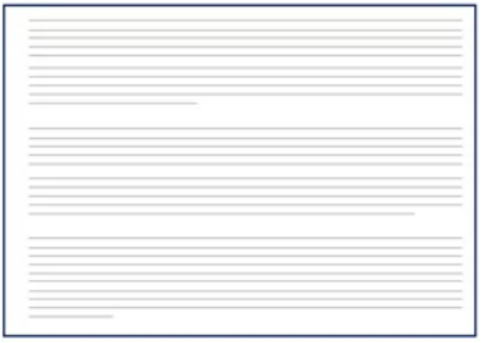
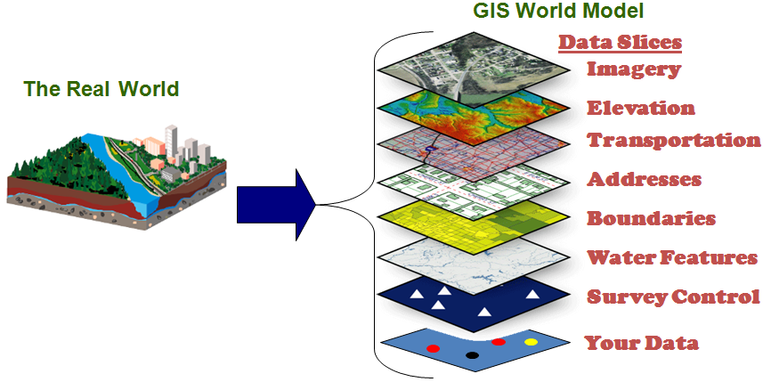
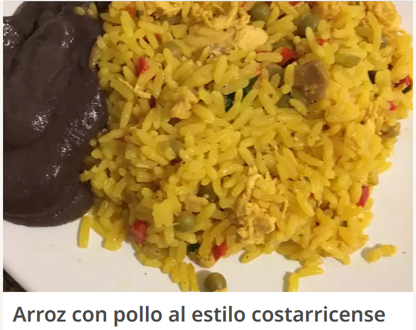
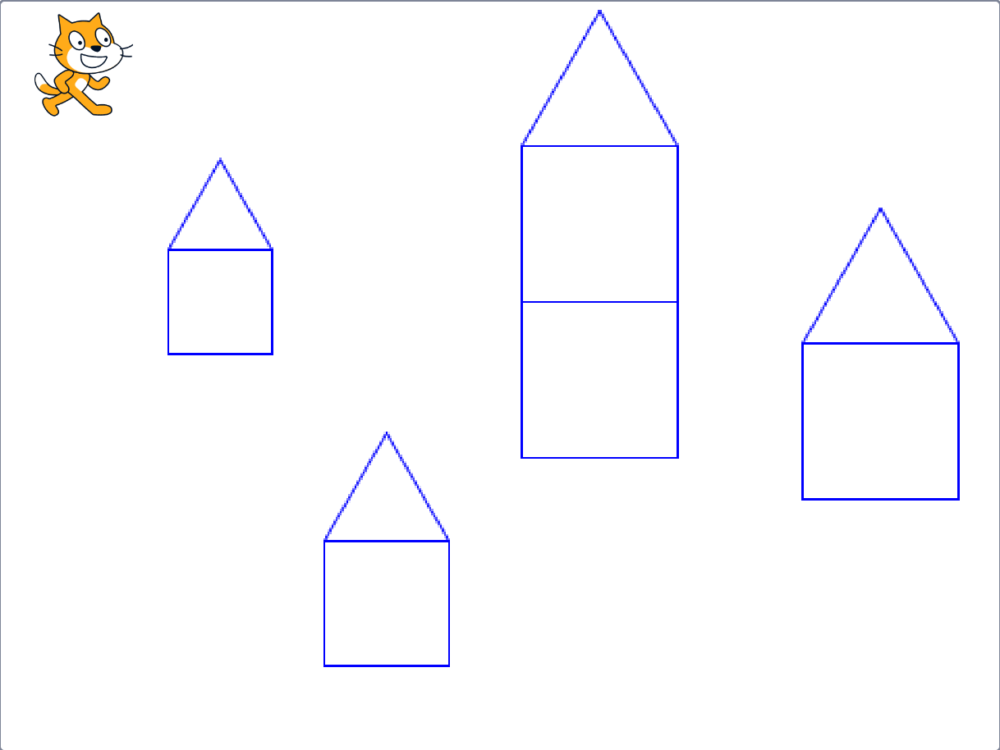

class: title-slide, right, top
background-image: url(img/turing-machine.png)
background-size: contain

.right-column[
# `r rmarkdown::metadata$title`

`r rmarkdown::metadata$author`<br>
`r rmarkdown::metadata$institute`
]

.palegrey[.left[.footnote[<small>Representación artística de una [máquina de Turing](https://es.wikipedia.org/wiki/M%C3%A1quina_de_Turing). Fuente: [Porao](https://commons.wikimedia.org/wiki/File:Turing_Machine.png).</small>]]]

---

# Contenidos

- ### ¿Qué es pensamiento computacional?

- ### Conceptos fundamentales del pensamiento computacional:
  - #### Descomposición.
  - #### Reconocimiento de patrones.
  - #### Abstracción.
  - #### Algoritmos.
  
- ### Introducción al lenguaje Scratch.

---

# Resolución de problemas mediante computadoras

--
### Las computadoras pueden ayudar a resolver problemas en muchas áreas.

--


--
### Los métodos para encontrar las soluciones a estos problemas deben expresarse de forma tal que puedan ser implementados en computadoras.

---

# ¿Qué es pensamiento computacional?

--
- ### Es un enfoque para la resolución de problemas basado en conceptos y métodos de las ciencias de la computación.

--
- ### Puede ser aplicado en muchas áreas, no solo en computación.

--
- ### Además de la programación, el pensamiento computacional incluye otras etapas como análisis, diseño y pruebas.

--
- ### Se considera una de las destrezas fundamentales del siglo XXI.

---

# Investigación en pensamiento computacional

--
.pull-left[
**Seymour Papert**  
<small>
Matemático, pionero de la inteligencia artificial, co-creador del lenguaje de programación Logo.
</small>
<p>
<figure>
  
  <figcaption>
    <small>Fuente: [ak_mardini](https://commons.wikimedia.org/wiki/File:Papert.jpg).</small>
  </figcaption>
</figure>
<p>
<small>
- *Mindstorms: Children, Computers, and Powerful Ideas* (1983)  
- [*An Exploration in the Space of Mathematics Educations* (1996)](http://www.papert.org/articles/AnExplorationintheSpaceofMathematicsEducations.html)
</small>
]

--
.pull-right[
**Jeannette Wing**  
<small>
Investigadora en ciencias de la computación, ex vicepresidente de Microsoft Research.
</small>
<p>
<figure>
  
  <figcaption>
    <small>Fuente: [World Economic Forum](https://commons.wikimedia.org/wiki/File:Jeannette_Wing,_Davos_2013.jpg).</small>
  </figcaption>
</figure>
<p>
<small>
- [*Computational thinking* (2006)](https://www.cs.cmu.edu/~15110-s13/Wing06-ct.pdf)
</small>
]

---

# ¿Qué implica resolver problemas mediante pensamiento computacional?

--
## Se identifican cuatro conceptos fundamentales:

--
- ### **Descomposición**: división de un problema en subproblemas más pequeños.

--
- ### **Reconocimiento de patrones**: búsqueda de similitudes en los problemas.

--
- ### **Abstracción**: identificación de la información que se necesita y filtrado de la que no se necesita para resolver un problema.

--
- ### **Algoritmos**: descripción, paso por paso, de la solución a un problema.

---

# Descomposición

--
- ### División de un problema complejo en subproblemas más fáciles de resolver.

--
- ### La unión de las soluciones a los subproblemas brinda la solución al problema original.

---

# Descomposición - ejemplo
## Escritura de un documento

--
.pull-left[
### Documento sin secciones
<figure>
  
  <figcaption>
    <small>Fuente: <a href="https://www.coursera.org/learn/computational-thinking-problem-solving">Universidad de Pennsylvania</a>.</small>
  </figcaption>
</figure>
]

--
.pull-right[
### Documento con secciones
<figure>
  
  <figcaption>
    <small>Fuente: <a href="https://www.coursera.org/learn/computational-thinking-problem-solving">Universidad de Pennsylvania</a>.</small>
  </figcaption>
</figure>
]

---

# Descomposición - ejemplo
## Mapas de teselas (*tile maps*)

--
Se componen de múltiples rectángulos (teselas o *tiles*) de diferentes tamaños que se agregan y desagregan conforme se requiere en acercamientos, alejamientos y otras operaciones.

--
<br><br>
<figure>
  
  <figcaption>
    <small>Fuente: <a href="https://commons.wikimedia.org/wiki/File:Tiled_web_map_Stevage.png">Stevage</a>.</small>
  </figcaption>
</figure>

---

# Reconocimiento de patrones

--
- ### Se buscan similitudes o características compartidas entre problemas o componentes de un mismo problema.

--
- ### Facilita la resolución de un problema al aplicarse una respuesta ya desarrollada.

---

# Reconocimiento de patrones - ejemplo
## Patrones arquitectónicos

--
.pull-left[
- Son posibles soluciones para problemas de diseño arquitectónico. Christopher Alexander et al. recopilaron más de 200 en su libro [*A Pattern Language: Towns, Buildings, Construction* (1977)](https://laptrinhx.com/a-pattern-language-3372046788/).

- "*Cada patrón describe un problema que ocurre infinidad de veces en nuestro entorno, así como la solución al mismo, de tal modo que podemos utilizar esta solución un millón de veces más adelante sin tener que volver a pensarla otra vez.*" (Christopher Alexander)
]

--
.pull-right[
<figure>
  
  <figcaption>
    <small>Fuente: <a href="https://laptrinhx.com/a-pattern-language-3372046788/">A Pattern Language</a>.</small>
  </figcaption>
</figure>
]

---

# Reconocimiento de patrones - ejemplo
## Patrones de diseño de software

--
.pull-left[
- Inspirados en las ideas de Alexander, varios ingenieros de software desarrollaron patrones para resolver problemas comunes de desarrollo de software.

- Los patrones de diseño de software alcanzaron gran popularidad con la publicación del libro [*Design Patterns: Elements of Reusable Object-Oriented Software* (1994)](https://en.wikipedia.org/wiki/Design_Patterns), escrito por Erich Gamma, Richard Helm, Ralph Johnson y John Vlissides; y en el cual se documentan [23 patrones de diseño de software](https://en.wikipedia.org/wiki/Design_Patterns#Patterns_by_type).
]

--
.pull-right[
<figure>
  
  <figcaption>
    <small>Diagrama de interacciones en el patrón de diseño de software denominado <a href="https://es.wikipedia.org/wiki/Modelo%E2%80%93vista%E2%80%93controlador">Modelo-Vista-Controlador o <em>Model-View-Controller</em> (MVC)</a>. Fuente: <a href="https://commons.wikimedia.org/wiki/File:MVC-Process.svg">RegisFrey</a>.</small>
  </figcaption>
</figure>
]

---

# Abstracción

--
- ### Identificación de cuáles aspectos de un problema son importantes y de cuáles no lo son.

--
- ### Ayuda a construir un modelo de la solución.

--
- ### Se aplica en modelado de datos.

---

# Abstracción - ejemplo
## Selección de atributos de un conjunto de datos

--
.pull-left[
### Atributos generales de una persona
- Nombre
- Edad
- Ingreso mensual
- Historial académico
- Pasatiempos
- Color favorito
- Estatura
- Peso
- Historial médico
- ...
]

--
.pull-right[
#### Atributos a considerar para la BD de una universidad
- Nombre
- Edad
- Historial académico
- ...

#### Atributos a considerar para la BD de una red social
- Nombre
- Edad
- Pasatiempos
- ...
]

---

# Abstracción - ejemplo
## Capas temáticas de un SIG
Las capas temáticas son una abstracción de un espacio geográfico

--
<figure>
  
  <figcaption>
    <small>Fuente: <a href="http://www.admitnetwork.org/work-packages/gis-gps/">Admit</a>.</small>
  </figcaption>
</figure>

---

# Algoritmos

--
- ### Indicaciones detalladas de como resolver, paso por paso, un problema.

--
- ### Especifican el orden en el que deben ejecutarse los pasos, así como las condiciones que deben cumplirse antes de cada paso.

---

# Algoritmos - ejemplo
## Receta de cocina

--
<figure>
  
  <figcaption>
    <small>Fuente: <a href="https://cookpad.com/cr/recetas/6014919-arroz-con-pollo-al-estilo-costarricense">Cookpad</a>.</small>
  </figcaption>
</figure>

---

# Algoritmos - ejemplo
## Obtener el valor máximo de una lista

--
#### lista = [29.6, -36.81, 31.85, 25.71, 90.2, 0.4]

--
Solo es posible comparar dos elementos de la lista a la vez, para determinar si uno es mayor que otro.

--
#### Algoritmo

--
1. Se lee la lista (del teclado, de un archivo o de alguna otra fuente).

--
2. Si la lista está vacía, se despliega la hilera de texto "Lista vacía" y se concluye el proceso. Si no, se continúa con el paso 3.

--
3. Se designa el primer elemento de la lista como "máximo actual".

--
4. Se recorre la lista y se compara cada uno de los elementos con el máximo actual.

--
5. Si un elemento comparado es mayor que el máximo actual, entonces pasa a ser el nuevo máximo actual.

--
4. El valor máximo de la lista es el máximo actual, cuando termina de recorrerse la lista.

---

# Algoritmos - ejemplo
## Obtener el valor máximo de una lista (continuación)

--
### Ejecución del algoritmo

--
<span style="color:green";>elemento en verde = máximo actual</span>  
<span style="color:red";>elemento en rojo  = elemento que está siendo comparado</span>
<p>

--
[<span style="color:green;">29.6</span>, <span style="color:red;">-36.81</span>, 31.85, 25.71, 90.2, 0.4]  
<p>

--
[<span style="color:green;">29.6</span>, -36.81, <span style="color:red;">31.85</span>, 25.71, 90.2, 0.4]  
<p>

--
[29.6, -36.81, <span style="color:green;">31.85</span>, <span style="color:red;">25.71</span>, 90.2, 0.4]  
<p>

--
[29.6, -36.81, <span style="color:green;">31.85</span>, 25.71, <span style="color:red;">90.2</span>, 0.4]  
<p>

--
[29.6, -36.81, 31.85, 25.71, <span style="color:green;">90.2</span>, <span style="color:red;">0.4</span>]  
<p>

--
[29.6, -36.81, 31.85, 25.71, <span style="color:green;">90.2</span>, 0.4]  
<p>

--
### Valor máximo = <span style="color:green;">90.2</span>

---

# Algoritmos - diagramas de flujo

--
.pull-left[
- ### Los [diagramas de flujo](https://es.wikipedia.org/wiki/Diagrama_de_flujo) son representaciones diagramáticas de un algoritmo.
- ### Representan los pasos del algoritmo mediante [símbolos](https://es.wikipedia.org/wiki/Diagrama_de_flujo#Simbolog%C3%ADa_y_significado) y su orden de ejecución mediante flechas.
- ### Por convención, se leen de arriba hacia abajo o de izquierda a derecha.
]

--
.pull-right[
#### Ejemplo: obtener el máximo de una lista
<figure>
  
</figure>
]

---

# Algoritmos - pseudocódigo

--
.pull-left[
- ### El [pseudocódigo](https://es.wikipedia.org/wiki/Pseudoc%C3%B3digo) es una descripción textual y en lenguaje natural de un algoritmo.
- ### Su estructura se asemeja a la de un lenguaje de programación, pero está diseñado para que ser comprendido por personas, no para ser ejecutado por computadoras.
]

--
.pull-right[
#### Ejemplo: obtener el máximo de una lista
```r
LISTA <- Leer()
si (Vacia(LISTA)) {
  Desplegar("Lista vacía")
} si no {
  MAX <- LISTA[1]
  I <- 1
  mientras (I <= Longitud(LISTA)) {
    ITEM <- LISTA[I]
    si (ITEM > MAX) {
      MAX <- ITEM
    }
    I <- I + 1
  }
  Desplegar(MAX)
}
```
]

---

# Algoritmos - implementación en [R](https://www.r-project.org/)

```r
# Obtener el valor máximo de una lista

lista <- c(29.6, -36.81, 31.85, 25.71, 90.2, 0.4)
cat("Lista de entrada: ", lista, "\n")

if (length(lista) == 0) {
  cat("La lista está vacía", "\n")
} else {
  max <- lista[1]
  i <- 1
  while (i <= length(lista)) {
    if (lista[i] > max) {
      max <- lista[i]
    }
    i <- i + 1
  }
  
  cat("Valor máximo de la lista: ", max, "\n")
}
```
<small>
  [Archivo con código fuente en R](https://github.com/gf0604-procesamientodatosgeograficos/2021i-leccion-01-introduccion-pensamiento-computacional/blob/master/valor-maximo-lista/valor-maximo-lista.R)
</small>

---

# Algoritmos - implementación en [Python](https://www.python.org/)

```python
# Obtener el valor máximo de una lista

lista = [29.6, -36.81, 31.85, 25.71, 90.2, 0.4]
print("Lista de entrada: ", lista)

if (len(lista) == 0):
    print("La lista está vacía")
else:
    max = lista[0]
    i = 0
    while (i < len(lista)):
        if (lista[i] > max):
            max = lista[i]
        i = i + 1
        
    print("Valor máximo de la lista:", max)  
```
<small>
  [Archivo con código fuente en Python](https://github.com/gf0604-procesamientodatosgeograficos/2021i-leccion-01-introduccion-pensamiento-computacional/blob/master/valor-maximo-lista/valor-maximo-lista.py)
</small>

---

# Algoritmos
## Entrada -> Procesamiento -> Salida

--
Este patrón describe el flujo de procesamiento básico de cualquier algoritmo o programa.

<br><br>
<figure>
  
</figure>

---

# El lenguaje de programación Scratch

.pull-left[
- [Scratch](https://scratch.mit.edu/) es un lenguaje de programación orientado a educación. Su nombre proviene de la palabra [*scratching*](https://en.wikipedia.org/wiki/Scratching).

- [*"Scratch ayuda a las personas jóvenes a pensar creativamente, razonar sistemáticamente y trabajar colaborativamente..."*](https://scratch.mit.edu/about).

- Fue desarrollado en 2003 (una versión de escritorio) por el [MIT Media Lab](https://www.media.mit.edu/) y es administrado por la Fundación Scratch, una organización sin fines de lucro que lo facilita de manera gratuita.

- Scratch es software libre distribuido mediante licencia [GPLv2](https://es.wikipedia.org/wiki/GNU_General_Public_License).
]

.pull-right[
<figure>
  
  <figcaption>
    <small>Fuente: <a href="https://commons.wikimedia.org/wiki/File:Scratchlogo.svg">Scratch Team</a>.</small>
  </figcaption>
</figure>
]

---

# Práctica de programación con Scratch
## Considere este paisaje:


---

# Práctica de programación con Scratch

- Ingrese al sitio web de [Scratch](https://scratch.mit.edu/) y estudie la intefaz del ambiente de desarrollo. Puede buscar información adicional en otros sitios (Google, YouTube, etc.). Revise ejemplos y proyectos de otras personas para saber qué puede hacer con Scratch.

- Utilizando los cuatro principios fundamentales del pensamiento computacional, desarrolle un algoritmo para dibujar el paisaje de la diapositiva anterior. Considere las siguientes preguntas orientadoras:

  - ¿Cómo puede dividirse el problema?
  - ¿Qué patrones observa (formas, tamaños, etc.)?
  - ¿Qué información se necesita para hacer los dibujos (ej. medidas)?
  - ¿Qué nivel de detalle requiere el algoritmo?
  
- Implemente en Scratch el algoritmo que desarrolló.

---

# Práctica de programación con Scratch
## Aplicación de pensamiento computacional

### Descomposición
**Subproblemas**
- Dibujar casa
  - Dibujar base
  - Dibujar techo
  
- Dibujar edificio
  - Dibujar base
  - Dibujar base
  - Dibujar techo
  
---

# Práctica de programación con Scratch
## Aplicación de pensamiento computacional

### Reconocimiento de patrones
**Patrones identificados**
- Dibujar base --> dibujar cuadradado
- Dibujar techo --> dibujar triángulo

---

# Práctica de programación con Scratch
## Aplicación de pensamiento computacional

### Abstracción

**Atributos necesarios para dibujar las figuras**
- Coordenada x
- Coordenada y
- Longitud del lado (de cuadrados y triángulos)

---

# Práctica de programación con Scratch
## Aplicación de pensamiento computacional

### Algoritmo en pseudocódigo
Nota: las posiciones (x, y) que se pasan como parámetros corresponden a la esquina inferior izquierda de las figuras.

```
dibujar_paisaje
  borrar_todo
  dibujar_casa (-160, 10, 50)
  dibujar_casa (-85, -140, 60)
  dibujar_casa (145, -60, 75)
  dibujar_edificio (10, -40, 75)  
```  

---

```
dibujar_casa (x, y, lado)
  dibujar_base (x, y, lado)
  dibujar_techo (x, y + lado, lado)

dibujar_edificio (x, y, lado)
  dibujar_base (x, y, lado)
  dibujar_base (x, y + lado, lado)
  dibujar_techo (x, y + lado*2, lado)
  
dibujar_base (x, y, lado)
  subir_lapiz
  ir_a (x, y)
  apuntar_en_direccion (90)
  bajar_lapiz
  repetir 4 veces
    esperar_segundos (0.5)
    mover (lado)
    girar_derecha (90)
    
dibujar_techo (x, y, lado)
  subir_lapiz
  ir_a (x, y)
  bajar_lapiz
  apuntar_en_direccion (90)
  repetir 3 veces
    esperar_segundos (0.5)
    mover (lado)
    girar_izquierda (120)
    
```

---

# Práctica de programación con Scratch
## Aplicación de pensamiento computacional

### Resultado de la implementación del algoritmo en Scratch



[Código fuente](https://github.com/gf0604-procesamientodatosgeograficos/2021i-leccion-01-introduccion-pensamiento-computacional/raw/master/paisaje/paisaje.sb3)